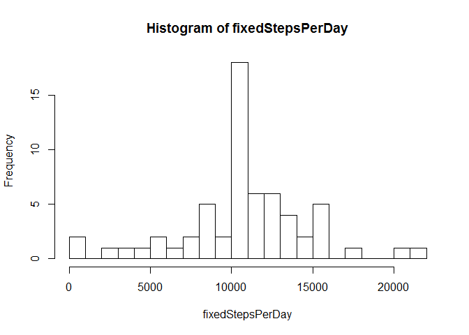

# Reproducible Research: Peer Assessment 1


```r
library(dplyr)
library(ggplot2)
```


## Loading and preprocessing the data

First of all lets download an unzip the data.


```r
filename <- "activity.zip" 
download.file("https://d396qusza40orc.cloudfront.net/repdata%2Fdata%2Factivity.zip", filename);
unzip(filename)  
```

Now lets load it in variable named "activity". Get "NA" text values in field steps as NA.


```r
activity <- read.csv("activity.csv", na.strings=c("NA") ) 
summary(activity)
```

```
##      steps                date          interval     
##  Min.   :  0.00   2012-10-01:  288   Min.   :   0.0  
##  1st Qu.:  0.00   2012-10-02:  288   1st Qu.: 588.8  
##  Median :  0.00   2012-10-03:  288   Median :1177.5  
##  Mean   : 37.38   2012-10-04:  288   Mean   :1177.5  
##  3rd Qu.: 12.00   2012-10-05:  288   3rd Qu.:1766.2  
##  Max.   :806.00   2012-10-06:  288   Max.   :2355.0  
##  NA's   :2304     (Other)   :15840
```

And will also load those with a valid value in steps in a variable named "validActivity".


```r
validActivity <- subset(activity, !is.na(steps))
summary(validActivity)
```

```
##      steps                date          interval     
##  Min.   :  0.00   2012-10-02:  288   Min.   :   0.0  
##  1st Qu.:  0.00   2012-10-03:  288   1st Qu.: 588.8  
##  Median :  0.00   2012-10-04:  288   Median :1177.5  
##  Mean   : 37.38   2012-10-05:  288   Mean   :1177.5  
##  3rd Qu.: 12.00   2012-10-06:  288   3rd Qu.:1766.2  
##  Max.   :806.00   2012-10-07:  288   Max.   :2355.0  
##                   (Other)   :13536
```


## What is mean total number of steps taken per day?

For this part of the assignment, you can ignore the missing values in the dataset.

1. Calculate the total number of steps taken per day
1. If you do not understand the difference between a histogram and a barplot, research the difference between them. Make a histogram of the total number of steps taken each day
3. Calculate and report the mean and median of the total number of steps taken per day
 
  
  
Get the total of each day, excluding NAs


```r
stepsPerDay <- with(data=validActivity,  tapply(steps, date, sum))
```

Get a histogram of the total steps per day

```r
hist(stepsPerDay, breaks=20)
```


The zone around 10000 is the most populated. Lets calculate mean and median


```r
mean(stepsPerDay[!is.na(stepsPerDay)])
```

```
## [1] 10766.19
```

```r
median(stepsPerDay[!is.na(stepsPerDay)])
```

```
## [1] 10765
```


## What is the average daily activity pattern?

1. Make a time series plot (i.e. type = "l") of the 5-minute interval (x-axis) and the average number of steps taken, averaged across all days (y-axis)


```r
averageByInterval <- validActivity %>% group_by(interval) %>% summarize(steps = mean(steps))
plot(averageByInterval, type="l")
```


2. Which 5-minute interval, on average across all the days in the dataset, contains the maximum number of steps?

```r
averageByInterval[which.max(averageByInterval$steps),]
```

```
## Source: local data frame [1 x 2]
## 
##   interval    steps
##      (int)    (dbl)
## 1      835 206.1698
```


## Imputing missing values
Note that there are a number of days/intervals where there are missing values (coded as NA). The presence of missing days may introduce bias into some calculations or summaries of the data.

1. Calculate and report the total number of missing values in the dataset (i.e. the total number of rows with NAs)


```r
sum(is.na(activity$steps))
```

```
## [1] 2304
```

2. Devise a strategy for filling in all of the missing values in the dataset. The strategy does not need to be sophisticated. For example, you could use the mean/median for that day, or the mean for that 5-minute interval, etc.
3. Create a new dataset that is equal to the original dataset but with the missing data filled in.

Lets use that last option, this way we can leverage the averageByInterval we have calculated before

```r
fixedActivity <- activity
naValues <- is.na(fixedActivity$steps)
fixedActivity$steps[naValues] <- averageByInterval[match(fixedActivity$interval[naValues], averageByInterval$interval),]$steps
```

4. Make a histogram of the total number of steps taken each day and Calculate and report the mean and median total number of steps taken per day. Do these values differ from the estimates from the first part of the assignment? What is the impact of imputing missing data on the estimates of the total daily number of steps?


```r
fixedStepsPerDay <- with(data=fixedActivity,  tapply(steps, date, sum))
```

Get a histogram of the total steps per day

```r
hist(fixedStepsPerDay, breaks=20)
```



The zone around 10000 is the most populated. Lets calculate mean and median


```r
mean(fixedStepsPerDay)
```

```
## [1] 10766.19
```

```r
median(fixedStepsPerDay)
```

```
## [1] 10766.19
```

The mean values has not changed, but the median has changed and now is exactly the same as the mean.

## Are there differences in activity patterns between weekdays and weekends?


For this part the weekdays() function may be of some help here. Use the dataset with the filled-in missing values for this part.

1. Create a new factor variable in the dataset with two levels - "weekday" and "weekend" indicating whether a given date is a weekday or weekend day.

As we are using the name of the weekday, lets be sure the environment is in english


```r
Sys.setlocale("LC_ALL","English")
```

```
## [1] "LC_COLLATE=English_United States.1252;LC_CTYPE=English_United States.1252;LC_MONETARY=English_United States.1252;LC_NUMERIC=C;LC_TIME=English_United States.1252"
```

```r
fixedActivity$weekdaytype <- as.factor(ifelse(weekdays(as.Date(activity$date)) %in% c("Saturday", "Sunday"), "weekend", "weekday"))
```


2. Make a panel plot containing a time series plot (i.e. type = "l") of the 5-minute interval (x-axis) and the average number of steps taken, averaged across all weekday days or weekend days (y-axis). See the README file in the GitHub repository to see an example of what this plot should look like using simulated data.


```r
averageByIntervalAndDateType <- fixedActivity %>% group_by(interval, weekdaytype) %>% summarize(steps = mean(steps))
ggplot(averageByIntervalAndDateType, aes(x=interval, y=steps, color = weekdaytype)) +
  geom_line() +
  facet_wrap(~weekdaytype, ncol = 1, nrow=2)
```


